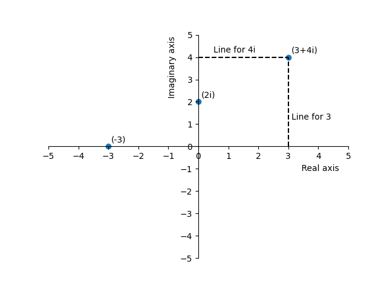

<h1>Algebra</h1>

<h2>Complex Numbers</h2> 

Now that we've covered how to solve equations, let's see how to solve the following equation for \\(x\\):

$$x^2=-1$$

To get x alone, we take the square root of both sides:

$$x=\sqrt{-1}$$

So, \\(x\\) is equal to the square root of negative one. But, what does that actually mean? Well, let's remember that the square root of something is the number that, when multiplied by itself, equals that something. For example, the square root of \\(25\\) is \\(5\\) because \\(5\cdot5=25\\). So, what number times itself equals \\(-1\\)?

When we multiply a positive number by itself, the answer is positive. When we multiply a negative number by itself, the answer is positive as well, because a negative times a negative equals a positive. For example:

$$
\begin{align*}
-5\cdot-5&=25\\
-6\cdot-6&=36
\end{align*}$$

This means that no matter what number we multiply by itself, we will never get a negative answer. Because of this, there is no number that we can square to get \\(-1\\), so \\(\sqrt{-1}\\) does not have an answer.

To solve this problem, mathematicians introduced a new number to solve this problem: \\(i\\). We define \\(i\\) squared to be negative 1:

$$
\begin{align*}
i^2=-1\\
i = \sqrt{-1}
\end{align*}$$

\\(i\\) is not a variable. It is a number, in the same way that 1, 2, 3, 4… are all numbers. However, it is a different type of number - an <b>imaginary number</b>. An imaginary number is a regular number multiple by \\(i\\). For example, \\(5i\\) is an imaginary number because it is \\(5\cdot i\\), or \\(5\cdot \sqrt{-1}\\).

A <b>complex number</b> is a number that has an real component and an imaginary component, added to each other. Some examples of complex numbers are \\(3+2i\\), \\(4-5i\\), or \\(-2-0.5i\\). Complex numbers can be visualized on the <b>complex plane</b>, where the vertical axis represents the imaginary numbers and the horizontal axis represent real numbers. Each point on the complex plane is a complex number.

