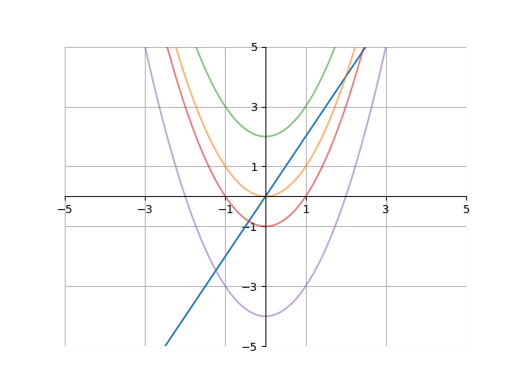

<h1>Calculus I</h1>

<h2>Antiderivatives</h2> 

We've gone over what the derivative of a function actually means - the rate of change of the function at a given \\(x\\) value. We've also gone over how to find the derivative of a function using certain rules. Now, let's go over another type of problem - finding a function based on its derivative.

For example, what function \\(a(x)\\) makes the following equation true?

$$\frac{d}{dx} a(x) = 2x$$

In other words, what function's derivative is \\(2x\\)? Well, because of the power rule, \\(f(x) = x^2\\). What we have just found is an <b>antiderivative</b> - the inverse operation of a derivative. In other words, the antiderivative of the derivative of a function is equal to the function itself. The antiderivative of \\(2x\\) is \\(x^2\\) because the derivative of \\(x^2\\) is \\(2x\\). Note that this is not quite the full answer; continue reading to see why the real answer is slightly different.

We symbolize the antiderivative of a function f(x) with the following notation:

$$\int f(x)\,dx$$

There are three parts to the notation of the antiderivative. The first is the \\(\int\\) symbol at the far left. This is supposed to represent an outstretched “S” (this “s” stands for <i>sum</i> - we'll talk about why later). The second part is the \\(dx\\) at the far right. In a sense, we are multiplying \\(f(x)\\) with \\(dx\\). You should recognize this symbol from the denominator of the derivative symbol. Why does the \\(dx\\) symbol appear here? Recall that we divide by \\(dx\\) when taking a derivative. Because the antiderivative is the inverse operation of a derivative, it makes sense we multiply by \\(dx\\), because multiplication is the inverse operation of the derivative. The third and final part is the \\(f(x)\\). This is the actual function we are finding the antiderivative of. This is enclosed between the \\(\int\\) and the \\(dx\\). Much like how a left parentheses cannot be written without a right parentheses, a \\(\int\\) cannot be written without a \\(dx\\).

Let's try to see if we can find the antiderivative of some functions. Let's go back to the \\(2x\\) example. Earlier, we said that the antiderivative of \\(2x\\), or \\(\int 2x\,dx\\), was \\(x^2\\). While it's true that \\(\frac{d}{dx} x^2 = 2x\\), the following are true as well:

$$\frac{d}{dx}x^2=2x\\
\frac{d}{dx}[x^2+1]=2x\\
\frac{d}{dx}[x^2-40]=2x\\
\frac{d}{dx}\left[x^2+\frac{\pi}{4}\right]=2x$$

The reason all of the above are true is because the derivative of any constant is just 0. Because of this, there are actually an infinite number of functions whose derivative is \\(2x\\). However, all of them can be written as

where \\(c\\) is a constant. This constant is known as the <b>constant of integration</b> (usually represented by \\(c\\). Thus, the actual antiderivative if \\(2x\\) is \\(x^2+c\\). Or, in mathematical terms,

$$\int2x\,dx = x^2+c$$

The reason the constant of integration is needed can be visualized on a graph. Here, we can see the graphs of \\(2x\\), as well as \\(x^2+c\\) with multiple values of \\(c\\).

(graph) x^2+c

Let's find the antiderivatives of some other functions. To start off, what is the antiderivative of \\(\cos(x)\\)? Remember the derivatives of trig functions. The derivative of \\(\sin(x)\\) is \\(\cos(x)\\), so the antiderivative of \\(\cos(x)\\) is \\(\sin(x)+c\\):

$$\int\cos(x)\,dx=\sin(x)+c$$

What is the antiderivative of \\(3x^2+5x^4\\)? Remember that in general, \\(\frac{d}{dx} x^n = nx^{n-1}\\) by the power rule. Knowing that,

$$\int3x^2+5x^4\,dx=x^3+x^5+c$$

because \\(\frac{d}{dx} x^3+x^5+c = 3x^2+5x^4\\).
