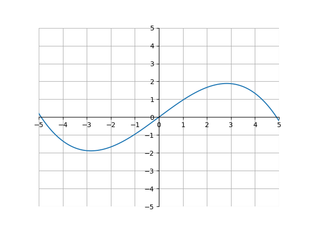

<h1>Calculus I</h1>

<h2>Derivatives</h2> 

In algebra, we learned what the slope of a linear function was. To review, the slope of a linear equation was the increase in y units for every 1 unit increase on the x-axis. For example, take a look at the following graph of \\(y = \frac{3}{2}x -1\\):

  

  

Because the line goes up 1.5 units for every 1 unit it goes to the right, we can say that the slope of this line is equal to 1.5. However, this will not work for other functions.

  

For example, look at the function \\(a(x)\\) below:

  

  

Because this function is curved, it doesn't have a single slope. Instead, the slope of the curve varies at different x-values. To show this, we can look at lines <b>tangent</b> to the curve at various points:

  

  

A tangent line is the line with the same slope at a point on a curve. In this case, because the slope of the tangent changes as \\(x\\) changes, we know that there is not one constant slope for the entire curve. This is in contrast to a linear equation, where there would just be one tangent line, and therefore one slope for the entire line.

  

Let's see we wanted to make another function, \\(b(x)\\), that describes the slope of \\(a(x)\\) for various values of \\(x\\). \\(b(x)\\) would look something like this:

  

  

Why is it like this? Well, \\(b(x)\\) is dependent on the slope of the tangent line to \\(a(x)\\) at \\(x\\). Notice that for every x-value, the slope of the tangent line to \\(a(x)\\) is equal to \\(b(x)\\). Or, shown visually:

  

  

We call \\(b(x)\\) the <b>derivative</b> of \\(a(x)\\). The derivative of a function is another function, whose values are the slopes of the respective tangent lines of \\(a(x)\\). Let's try to figure out how to construct the derivative of any function \\(f(x)\\).

  

We know that the derivative of a function will be another function in terms of \\(x\\). Thus, we are looking for some operation on a function \\(f(x)\\) (\\(f(x)\\) represents any function in terms of \\(x\\)). Let's take advantage of the slope formula we learned in algebra. The slope formula is

  

$$\text{slope of a linear function} = \frac{y_2-y_1}{x_2-x_1}$$

  

where \\((x_1, y_1)\\) and \\((x_2, y_2)\\) are coordinates on the line. At first glance, this doesn't look that useful, because that equation only works for linear functions and we are trying to find the derivative of a curve. But, this is still useful. Look at the following image:

  

  

This image shows how we can approximate any function using just lines. Now that we can construct any function with just lines, we can use the slope formula repeatedly. The more lines we use to approximate a curve, the more accurate the approximation will be. Or, written in another way, the smaller the x distance between lines, the closer the approximation will be to the true function. Notice how the \\(y=2x-1\\) line is a good approximation of the curve between \\(0.5 < x < 1.5\\), and decreasing the value of \\(h\\) will make that approximation more accurate.

  

Or, to write this algebraically,

  

$$\text{slope of a curve at } x \approx \frac{f(x+h)-f(x)}{(x+h)-(x)}$$

  

This is only an approximation. To make this exactly equal, we can use a limit:

  

$$\text{slope of a curve at } x = \lim_{h \to 0} \frac{f(x+h)-f(x)}{(x+h)-(x)}$$

  

Because the derivative is simply the slope of a curve at every \\(x\\) value, we can generalize this further to cover all \\(x\\) values:

  

$$\text{The derivative of a function } f(x) = \lim_{h \to 0} \frac{f(x+h)-f(x)}{(x+h)-(x)}$$

  

Which can be simplified to

  

$$\text{The derivative of a function } f(x) = \lim_{h \to 0} \frac{f(x+h)-f(x)}{h}$$

  

This is the definition of the derivative. Let's look at an example. Say we want to find the derivative of function \\(g(x)=x^2\\). Plugging into the definition of derivative, we have:

  

$$
g(x)=x^2\\
\begin{align*}
\text{Derivative of }x^2 &= \lim_{h \to 0} \frac{(x+h)^2-x^2}{h} \\
&=\lim_{x \to 0} \frac{x^2+2xh+h^2-x^2}{h} \\
&=\lim_{x \to 0} \frac{2xh+h^2}{h}\\
&=\lim_{x \to 0} \frac{h(2x+h)}{h}\\
&=\lim_{x \to 0} 2x+h \\
&=2x
\end{align*}
$$
  

Thus, the derivative of \\(x^2\\) is \\(2x\\) Overlaying these two functions on a graph, we see

  

  

This graph makes sense. For example, at \\(x=-1\\), the slope of \\(x^2\\) seems negative. Indeed, at \\(x=1\\), \\(2x\\) has a negative value. Or, at \\(x=0\\) the slope of \\(x^2\\) seems about 0. And at \\(x=0\\), \\(2x\\) is 0. This works for all \\(x\\) values.

  

Let's talk about notation. One way of writing “the derivative of \\(a(x)\\)” in shorthand notation is by using something called <b>Lagrange notation</b> (or prime notation). Lagrange notation involves drawing an apostrophe between the \\(f\\) and \\((x)\\) in a function:

$$\text{Derivative of function } f(x) = f'(x)$$

For example, when we found that the derivative of \\(x^2\\) = \\(2x\\), we could say:  

$$
f(x) = x^2 \\
f'(x) = 2x
$$

Another type of notation is using <b>Leibniz notation</b>. Leibniz notation is written as a fraction, with \\(d\\) in the numerator and \\(dx\\) in the denominator.

$$\frac{d}{dx} f(x) = f'(x) = \text{The derivative of f(x)}$$

There is a nice intuition for this type of notation. Remember when we used a line to approximate a curve? Let's zoom into that again. However, we will label the lines something different:

Here is the graph of \\(x^2\\), but zoomed into the domain \\(2 < x < 5\\). The \\(dx\\) and \\(dy\\) stands for the change in \\(x\\) and \\(y\\) between points \\((3, 9)\\) and \\((3+dx, 9+dy)\\) The idea here is that the slope is equal to \\(\frac{dy}{dx}\\), and because \\(y=f(x)\\), by saying \\(\frac{df(x)}{dx}\\) we are basically saying “the slope of the function f(x)”, which is a good loose definition of the derivative. Assuming \\(y=f(x)\\), all of these are equal:

$$\text{Assuming } y = f(x) \text{,} \\
\text{The derivative of } f(x) = f'(x) = y' = \frac{df(x)}{dx} = \frac{d}{dx}f(x) = \frac{dy}{dx}$$