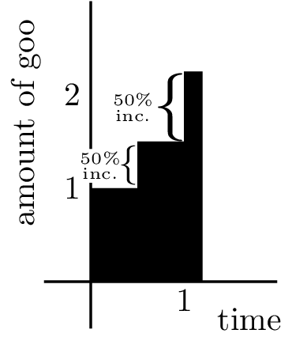

<h1>Calculus I</h1>

<h2>\(e\), the Universal Growth Constant</h2> 

\\(e\\) is an irrational number equal to about \\(2.718\\). It is an integral part of calculus, although it appears in far more fields. \\(e\\) represents the concept of continuous growth, and we will see how \\(e\\) can be derived and why it is so important.

Imagine a type of 2D goo that exists in an infinite 2D world. This special type of goo will grow and spread in a special way. To begin, let's define the intervals it will grow in. The goo below grows in intervals of 1 second with a growth rate of 100%. This means that every one second, the goo will grow by 100%:

Notice that at the end of 1 second, there are 2 units of goo present. This makes sense, because the goo grew by 100% after the first second. Now, let's imagine the same situation, but the goo grows in intervals of half a second instead. Every half second, the goo will grow by 50%:

Here, every 0.5 seconds, the amount of goo increases by 50%. After one second, the goo has gone through two iterations, and it's final amount is \\(2.25\\), because

$$\begin{align*}
1 & ~~ \text{ Amount after 0 iterations (0 sec)} \\
\underline{+ ~~ \text{50\% of 1}} & \\
1.5 & ~~ \text{ Amount after 1 iteration (0.5 sec)} \\
\underline{+ ~~ \text{50\% of 1.5}} & \\
2.25 & ~~ \text{ Amount after 2 iterations (1 sec)}
\end{align*}$$

Let's imagine another situation, where the goo grows in intervals of every one third of a second. Every one third of a second, the goo will grow by \\(33.\overline{3}\%\\):

At the end of the 1 second, our final amount of goo will be \\(2.\overline{370}\\):

$$\begin{align*}
1& ~~ \text{ Amount after 0 iterations (0 sec)}\\
\underline{+ ~~ \text{33.}\overline{3}\text{\% of 1}} &\\
1.\overline{33}& ~~ \text{ Amount after 1 iteration (0.}\overline{3}\text{ sec)} \\
\underline{+ ~~ \text{33.}\overline{3} \% \text{ of 1.}\overline{33}} &\\
1.\overline{77} & ~~ \text{ Amount after 2 iterations (0.}\overline{6}\text{ sec)} \\
\underline{+ ~~ \text{33.}\overline{3} \% \text{ of 1.}\overline{77}} &\\
2.\overline{370} & ~~ \text{ Amount after 3 iterations (1 sec)}
\end{align*}$$

So, how does this tie into \\(e\\)? Well, \\(e\\) is the amount of goo we have after 1 second when there are an infinite number of intervals between 0 seconds and 1 second. In the examples above, we had the number of intervals be \\(1\\), \\(2\\), and then \\(3\\). To get a nice closed form for \\(e\\), let's figure out the pattern.

The amount of goo always started at \\(1\\). Whenever we had \\(n\\) number of intervals, the goo increased by \\(\frac{100}{n}\%\\) every \\(\frac{1}{n}\\) seconds. For example, when we had three intervals, the amount of goo increased by \\(\frac{100}{3}\% = 33.\overline{3}\%\\) every \\(\frac{1}{3}\\) seconds.

$$\underbrace{1}_{\substack{\text{starting} \\ \text{value}}}\cdot \underbrace{\left(1+\frac{100}{3}\%\right)}_{\text{1st iteration}}\cdot\underbrace{\left(1+\frac{100}{3}\%\right)}_{\text{2nd iteration}}\cdot\underbrace{\left(1+\frac{100}{3}\%\right)}_{\text{3rd iteration}} = 2.\overline{370}$$

Because the \\(1\\) at the front doesn't really matter (anything multiplied by \\(1\\) is itself), we can just pretend like it isn't there. Now we have

$$\underbrace{\left(1+\frac{100}{3}\%\right)}_ {\text{1st iteration}}\cdot\underbrace{\left(1+\frac{100}{3}\%\right)}_{\text{2nd iteration}}\cdot\underbrace{\left(1+\frac{100}{3}\%\right)}_{\text{3rd iteration}}$$

Notice how we have repeated multiplication here. More specifically, we multiply the \\(1+\frac{100}{3}\%\\) term by itself \\(3\\) times. Because repeated multiplication is just exponentiation, we can replace that entire expression with

$$\left(1+\frac{100}{3}\%\right)^{\displaystyle 3}$$

This is just the case for \\(3\\) intervals though. If we have a general case of \\(n\\) intervals, our expression would be

$$\left(1+\frac{100}{n}\%\right)^{\displaystyle n}$$

  

Remember, we want to find \\(e\\), which takes \\(\infty\\) intervals. Now that we know the concept of a limit, let's use that to find the definition for \\(e\\) by just taking the number of intervals, or \\(n\\) to infinity.

  

$$e = \lim_{x \to \infty}\left(1+\frac{100}{n}\%\right)^{\displaystyle n}$$

  

Because \\(100\% = 1\\), we can make this look a little cleaner:

  

$$e = \lim_{x \to \infty}\left(1+\frac{1}{n}\right)^{\displaystyle n}$$

  

This is the definition of \\(e\\). The equation \\(e^x\\) is also very important, because if the goo grows the same way for, then \\(e^x\\) represents the amount of goo after \\(x\\) seconds. Note that

  

$$e^x = \lim_{n \to \infty}\left(1+\frac{x}{n}\right)^n$$

  

We can prove this: If \\(e = \lim_{x \to \infty}\left(1+\frac{1}{n}\right)^{n}\\), then

  

$$\begin{align*}
e^x &= \left[\lim_{n \to \infty}\left(1+\frac{1}{n}\right)^n\right]^x\\
&=\lim_{n \to \infty} \left[\left(1+\frac{1}{n}\right)^{n^x}\right]\\
&=\lim_{n \to \infty} \left(1+\frac{1}{n}\right)^{nx}\\
\end{align*}$$

  

We can let \\(u=nx\\). This means that \\(\frac{1}{n} = \frac{x}{u}\\) and as \\(n \to \infty\\), \\(u \to \infty\\) as well. Performing these substitutions, we have

  

$$\begin{align*}
e^x &= \left[\lim_{n \to \infty}\left(1+\frac{1}{n}\right)^n\right]^x\\
&=\lim_{n \to \infty} \left[\left(1+\frac{1}{n}\right)^{n^x}\right]\\
&=\lim_{n \to \infty} \left(1+\frac{1}{n}\right)^{nx}\\
&=\lim_{u \to \infty} \left(1+\frac{x}{u}\right)^u
\end{align*}$$

  

We have proven that \\(e^x = \lim_{n \to \infty} \left(1+\frac{x}{n}\right)^n\\). Later on, we'll see how \\(e^x\\) is arguably the most important equation in calculus.

  

Because \\(e^x\\) is so important, it's useful to have an equation that represents the inverse of \\(e^x\\). In precalculus, we covered how logarithms are the inverse of exponentials. Recall that \\(\log_b(x)\\) is the inverse of \\(b^x\\). In other words, \\(log_b(b^x) = x\\) and \\(b^{\log_b{x}} = x\\). Thus, the inverse of \\(e^x\\) is \\(\log_e(x)\\). Here is a graph of \\(e^x\\) and \\(\log_e(x)\\) - notice how they are the same graph, but flipped about \\(y=x\\).

  

  

Because \\(\log_e(x)\\) is such an important function, mathematicians decided to give it its own name, \\(\ln(x)\\). This is known as the <b>natural log</b>:

  

$$\ln(x) = \log_e(x)\\
e^{\ln(x)} = x\\
\ln(e^x) = x$$

  
