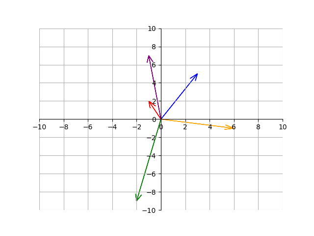
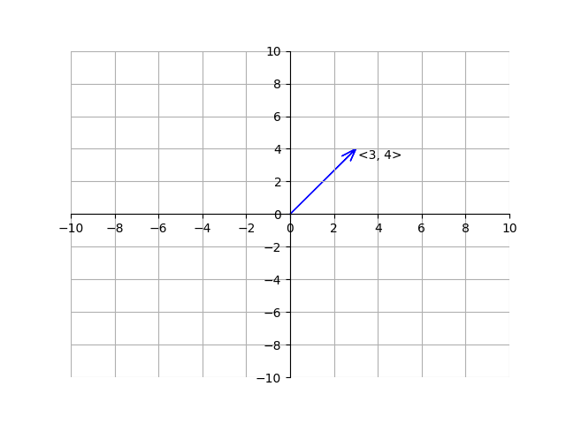
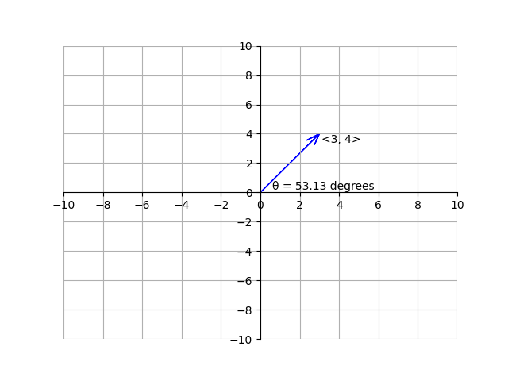
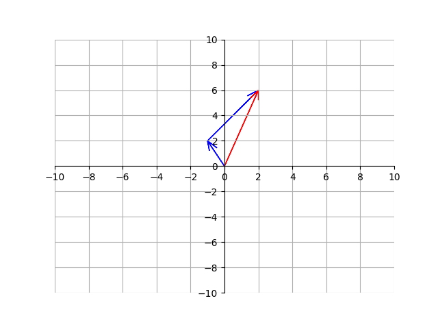
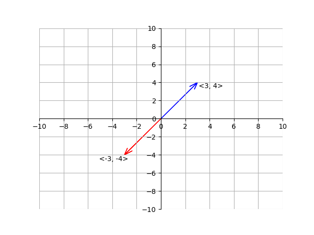

<h1>Precalculus</h1>

<h2>Vectors</h2> 

A <b>vector</b> is a geometric object that we draw as arrows on a graph. Here are some examples of vectors on a graph:

Thats right - a vector is basically just a an arrow emanating from the origin. The main thing to notice here is that all vectors contain two properties: a <b>magnitude</b> and a <b>direction</b>. The magnitude is the length of the vector. The direction is an angle. The direction is usually described by a number in degrees or radians. Because those are the only two properties vectors have, all vectors originate from the origin. This is why all of the tails of the vectors in the image start from the origin.

Vectors are written down as a letter with a small arrow over it: \\(\vec{v}\\). Each vector has two components, a horizontal component and a vertical component. The horizontal component is the horizontal distance from the tail to the head of the arrow, and the vertical component is the vertical distance from the tail of the head to the arrow. We write a vector by listing out the horizontal and vertical components surrounded by pointy brackets. Here is an example of a vector and how to write it:

As mentioned earlier, the magnitude of the vector is the shortest distance from its tail to its head. The notation of the magnitude of a vector is two straight vertical lines around it on each side. For example, the magnitude of vector \\(\vec{v}\\) is \\(\vert\vert \vec{v} \vert\vert\\). To find the magnitude of a 2-dimensional vector, we can use the Pythagorean theorem:

Because the horizontal component of the vector is \\(3\\) and the vertical component is \\(4\\) we can see the magnitude is \\(\sqrt{3^2+4^2} = 5\\). This gives us the general formula for the magnitude of a vector:

$$||\vec{v}|| = \sqrt{x^2+y^2}$$

where \\(x\\) is the horizontal component and \\(y\\) is the vertical component.

If the angle \\(\theta\\) of a vector is not given, we can use trigonometry to find it. For example, take the following vector:

Although we are not explicitly given \\(\theta\\), we can figure it out by using trigonometry. We know \\(\tan(\theta) = \frac{4}{3}\\), so we can take the inverse tangent of both sides to find \\(\theta = 53.13^\circ\\). Thus,

We can also add vectors. Let's first add vectors geometrically. To add two vectors geometrically, just place them such that the tail of one vector is on the head of another. This will give us a third vector:

Here, the blue vectors add up to the red vector. If we call the first blue vector \\(\vec{v_1}\\), the second blue vector \\(\vec{v_2}\\), and the red vector \\(\vec{v_3}\\), then we could say that \\(\vec{v_1}+\vec{v_2}=\vec{v_3}\\). To add a vector algebraically, we can just add the horizontal component of the first vector with the horizontal component of the second vector and do the same with the vertical components. This will give us the components of the vector sum. Because \\(\vec{v_1}=\,<-1, 2>\\), \\(\vec{v_2}=\,<3, 4>\\), then \\(\vec{v_3} = \vec{v_1} + \vec{v_2} \,=\, <-1, 2> + <3, 4> \, = \, <2, 6>\\). Subtracting a vector is the same process (except we subtract the components instead of add them).

To find the magnitude and direction of the vector sum, we can use the methods discussed earlier.

The negative of a vector is simply the opposite horizontal and vertical components. For example, here is the opposite of vector \\(\vec{v}\\):

We can also multiply a vector by a <b>scalar</b>. A scalar is just a regular number, like 5, -6, or \\(\pi\\). To multiply a vector by a scalar, we just multiply the horizontal and vertical components of the vector by the scalar quantity:

$$2\, \cdot <2, 4>  \, = \, <2 \cdot 2, 2\cdot4>, <4, 8>$$

Here is the example but geometrically:

